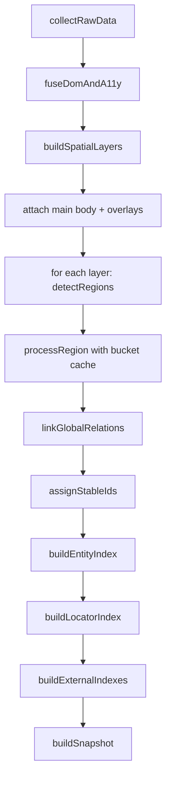
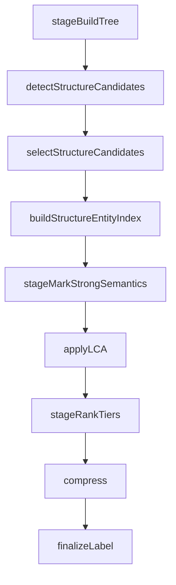

# Snapshot Pipeline Design

## 1. 目标

当前 snapshot executor 采用分阶段流水线，核心目标是：
- 保持 `UnifiedNode` 主树轻量稳定。
- 把“发现/选择/索引/压缩”拆成可组合 stage。
- 每个 stage 输入输出清晰，可独立调试与替换。

## 2. 主流程（`generateSemanticSnapshotFromRaw`）



## 3. Region 子流程（`processRegion`）



说明：
- `groups.ts` / `regions.ts` 负责候选发现。
- `candidates.ts` 负责统一评分、冲突消解、裁剪。
- `entity_index.ts` 负责把已选结构候选映射成 `EntityIndex`。

## 4. 主流程伪代码

```ts
function generateSemanticSnapshotFromRaw(raw: RawData): SnapshotResult {
  const cacheStats = createCacheStats();

  const graph = stageFuseGraph(raw);
  const layeredGraph = stageBuildSpatialGraph(graph);
  const root = stageAttachLayers(layeredGraph);

  stageProcessLayerRegions(root, cacheStats); // detectRegions + processRegion + bucket cache
  stageLinkGlobalRelations(root);
  stageAssignStableIds(root);

  return stageBuildSnapshot(root, cacheStats);
}
```

## 5. Region 流程伪代码

```ts
function processRegion(region: UnifiedNode): UnifiedNode | null {
  const tree = stageBuildTree(region);

  const detected = detectStructureCandidates(tree);
  const selected = selectStructureCandidates(tree, detected.candidates);
  const entityIndex = buildStructureEntityIndex(tree, selected, {
    includeDescendants: false,
  });

  stageMarkStrongSemantics(tree);
  applyLCA(tree, entityIndex);
  stageRankTiers(tree);

  const compressed = compress(tree);
  return compressed ? finalizeLabel(compressed) : null;
}
```

## 6. Stage 契约（当前实现）

- `collectRawData(page) -> RawData`
- `fuseDomAndA11y(domTree, a11yTree) -> NodeGraph`
- `buildSpatialLayers(graph) -> NodeGraph`
- `detectRegions(layer) -> UnifiedNode[]`
- `processRegion(region) -> UnifiedNode | null`
- `linkGlobalRelations(root) -> void`
- `assignStableIds(root) -> void`
- `buildEntityIndex(root) -> EntityIndex`
- `buildLocatorIndex({ root, entityIndex }) -> LocatorIndex`
- `buildExternalIndexes(root) -> { nodeIndex, bboxIndex, attrIndex, contentStore }`
- `buildSnapshot(...) -> SnapshotResult`

## 7. Control 组件基础设施

### 7.1 模型

```
UnifiedNode.control = { kind: string; ref: string } | undefined
SnapshotResult.controlIndex = Record<string, BaseControlComponent>  // 始终存在，无结果时为 {}
```

- `kind`: 注册方声明的稳定字符串，如 `native_select`、`radio_group`。
- `ref`: 指向 `controlIndex` 的 key，格式 `control:<kind>:<rootNodeId>`。
- 同一组件的 root、trigger、popup、option 节点共享同一个 `control.ref`。
- `controlIndex` 始终为稳定输出（空对象），消费方无需判空。

### 7.2 ControlCollectContext

ControlCollector 通过 `ControlCollectContext` 获取所有索引：

```ts
type ControlCollectContext = {
    root: UnifiedNode;
    nodeIndex: Record<string, UnifiedNode>;
    attrIndex: AttrIndex;
    contentStore: ContentStore;
    locatorIndex: LocatorIndex;
};

type ControlCollector = (ctx: ControlCollectContext) => BaseControlComponent[];
```

- collector 通过 `ctx.attrIndex[nodeId]` 读取属性，不再依赖 `getNodeAttr`。
- `readNodeText` 可通过 `ctx.contentStore` 解析 `content.ref`。
- `aria-controls`/`aria-owns` 通过 DOM id → nodeId 映射（基于 `attrIndex` 构建 `buildDomIdToNodeIdMap`）查找对应 snapshot 节点。

### 7.3 注册机制

```ts
// snapshot/control 提供基础设施，不包含具体组件识别逻辑
const registry = createControlRegistry();
registerControlCollector(registry, myCollector);

// select_option 作为首批注册方
registerSelectOptionControls(registry);
```

- `registerSelectOptionControls` 注册 native_select、radio_group、checkbox_group、custom_select 的 collector。
- 所有 collector 的 owner 为 `browser.select_option`，capabilities 包含 `select_option`。
- data 内保存 options、selectedValues、selectedLabels、optionMatchHints 等结构化事实。

### 7.4 默认装配

管线层 `snapshot/pipeline/snapshot.ts` 提供 `getDefaultControlRegistry()`：

```ts
const getDefaultControlRegistry = (): ControlRegistry => {
    if (!_defaultRegistry) {
        _defaultRegistry = createControlRegistry();
        registerSelectOptionControls(_defaultRegistry);
    }
    return _defaultRegistry;
};
```

- `generateSemanticSnapshot` / `generateSemanticSnapshotFromRaw` 未显式传入 `controlRegistry` 时默认使用已注册 select_option collectors 的 registry。
- `snapshot/control` 不 import `select_option`；装配位于管线组合层。

### 7.5 管线集成

```
stageBuildSnapshot 内部:
  1. buildExternalIndexes → { nodeIndex, attrIndex, contentStore, ... }
  2. buildLocatorIndex → locatorIndex
  3. 构建 ControlCollectContext { root, nodeIndex, attrIndex, contentStore, locatorIndex }
  4. registry = controlRegistry ?? getDefaultControlRegistry()
  5. collectControlComponents(ctx, registry) → controlIndex
  6. attachControlRefsToNodes(root, controlIndex)
  7. buildSnapshot({ ..., controlIndex })
```

- controlIndex 始终输出 {} 而非 undefined。
- duplicate ref 显式抛出异常（包含 ref、kind、rootNodeId、owner 信息）。

### 7.6 BaseControlComponent 结构

| 字段 | 必须 | 说明 |
|------|------|------|
| id | ✓ | 组件标识 |
| kind | ✓ | 组件类型 |
| owner | ✓ | 注册方（如 browser.select_option） |
| capabilities | ✓ | 支持的操作 |
| source | ✓ | 来源（auto） |
| confidence | ✓ | 置信度 0-1 |
| rootNodeId | ✓ | 组件根节点 |
| controlNodeId | | 控制节点（可选） |
| triggerNodeId | | 触发节点（可选） |
| popupNodeId | | 弹出层节点（可选） |
| labelNodeId | | 标签节点（可选） |
| valueNodeId | | 值节点（可选） |
| optionNodeIds | ✓ | 选项节点列表（缺省 []） |
| state | ✓ | 聚合状态（expanded/multiple/disabled/readonly/focused） |
| data | ✓ | 注册方自定义数据 |

### 7.7 识别规则

**native_select**：tag=select。读取子 option 节点、selected 状态。

**radio_group**：
- 先按最近 group/form/form-item 容器分区。
- 分区内按 name 属性聚合。
- 同 name 但不同区域的 radio 不合并。

**checkbox_group**：
- 优先识别 role=group、ant-checkbox-group/checkbox-group class。
- 找不到显式 group 时使用最近公共祖先。
- 不同表单区域的 checkbox 不合并。

**custom_select**：
- 主路径：role=combobox + aria-controls/aria-owns（DOM id → nodeId）。
- 辅助路径：ant-select/ant-select-selector class 信号 + ant-select-dropdown popup + ant-select-item-option 选项。
- class 辅助不覆盖标准 role/aria 主路径。

### 7.8 后续任务（不在本次提交）

- **record 侧**：录制时消费 controlIndex，产出中粒度 component 步骤。
- **select_option executor**：消费 controlIndex 而非重新 evaluate 选择状态。

## 8. 关键约束

- 不在 `UnifiedNode` 上塞入额外膨胀字段，重字段放在外置 index/store。
- `processRegion` 只处理 region 内部结构，不做跨 layer 关系。
- 候选资格最终决策只在 `candidates.ts` 统一完成，不在 detector 内做终裁。
- bucket cache 复用的是 region 处理结果（`processRegion` 输出子树）。
- `snapshot/control` 不 import `select_option`；注册方向为 select_option → control。
- role 字段保持原始 a11y 语义，不被组件语义污染。
- target 字段保持导航目标语义，不被组件语义污染。
