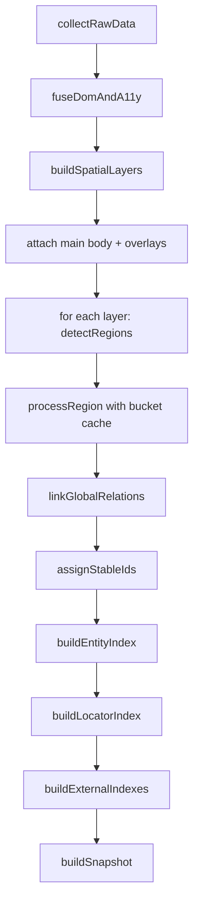
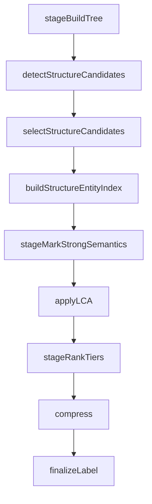

# Snapshot Pipeline Design

## 1. 目标

当前 snapshot executor 采用分阶段流水线，核心目标是：
- 保持 `UnifiedNode` 主树轻量稳定。
- 把“发现/选择/索引/压缩”拆成可组合 stage。
- 每个 stage 输入输出清晰，可独立调试与替换。

## 2. 主流程（`generateSemanticSnapshotFromRaw`）



## 3. Region 子流程（`processRegion`）



说明：
- `groups.ts` / `regions.ts` 负责候选发现。
- `candidates.ts` 负责统一评分、冲突消解、裁剪。
- `entity_index.ts` 负责把已选结构候选映射成 `EntityIndex`。

## 4. 主流程伪代码

```ts
function generateSemanticSnapshotFromRaw(raw: RawData): SnapshotResult {
  const cacheStats = createCacheStats();

  const graph = stageFuseGraph(raw);
  const layeredGraph = stageBuildSpatialGraph(graph);
  const root = stageAttachLayers(layeredGraph);

  stageProcessLayerRegions(root, cacheStats); // detectRegions + processRegion + bucket cache
  stageLinkGlobalRelations(root);
  stageAssignStableIds(root);

  return stageBuildSnapshot(root, cacheStats);
}
```

## 5. Region 流程伪代码

```ts
function processRegion(region: UnifiedNode): UnifiedNode | null {
  const tree = stageBuildTree(region);

  const detected = detectStructureCandidates(tree);
  const selected = selectStructureCandidates(tree, detected.candidates);
  const entityIndex = buildStructureEntityIndex(tree, selected, {
    includeDescendants: false,
  });

  stageMarkStrongSemantics(tree);
  applyLCA(tree, entityIndex);
  stageRankTiers(tree);

  const compressed = compress(tree);
  return compressed ? finalizeLabel(compressed) : null;
}
```

## 6. Stage 契约（当前实现）

- `collectRawData(page) -> RawData`
- `fuseDomAndA11y(domTree, a11yTree) -> NodeGraph`
- `buildSpatialLayers(graph) -> NodeGraph`
- `detectRegions(layer) -> UnifiedNode[]`
- `processRegion(region) -> UnifiedNode | null`
- `linkGlobalRelations(root) -> void`
- `assignStableIds(root) -> void`
- `buildEntityIndex(root) -> EntityIndex`
- `buildLocatorIndex({ root, entityIndex }) -> LocatorIndex`
- `buildExternalIndexes(root) -> { nodeIndex, bboxIndex, attrIndex, contentStore }`
- `buildSnapshot(...) -> SnapshotResult`

## 7. 关键约束

- 不在 `UnifiedNode` 上塞入额外膨胀字段，重字段放在外置 index/store。
- `processRegion` 只处理 region 内部结构，不做跨 layer 关系。
- 候选资格最终决策只在 `candidates.ts` 统一完成，不在 detector 内做终裁。
- bucket cache 复用的是 region 处理结果（`processRegion` 输出子树）。
