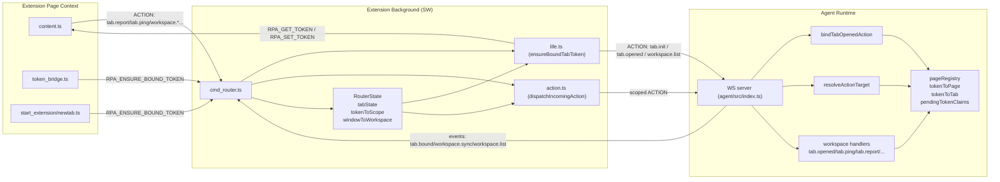
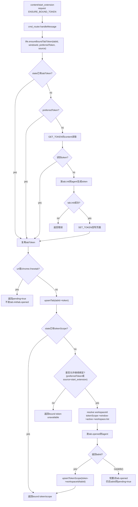
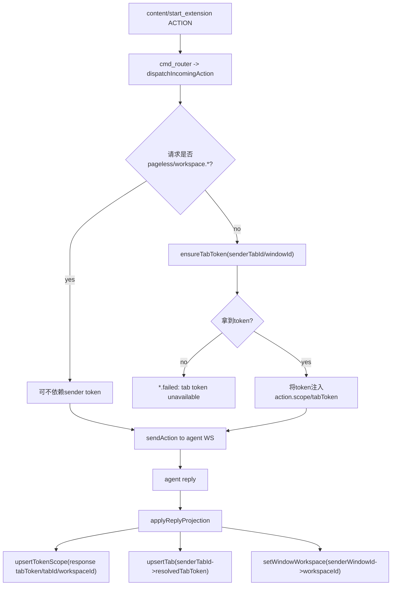
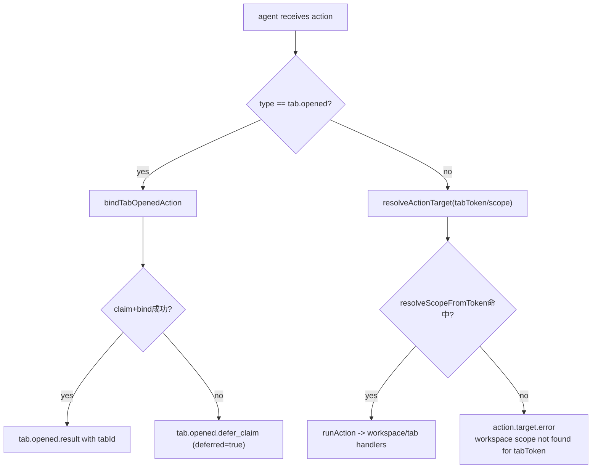

# Workspace 与 Tab 运行时

## 1. 目标与边界

本文档定义当前实现下 workspace / tab / tabToken 的运行时管理模型，覆盖：

- extension 侧（background/content/start_extension）token 生命周期
- agent 侧 workspace/tab 绑定与解析
- ping/report/activated/closed 等生命周期上报链路
- 失败语义（尤其 `resolve_scope_from_token.miss`、`tab.opened.defer_claim`）
- 当前已启用的保护策略与未完成事项

本文档按“当前代码事实”编写，不是理想设计稿。

---

## 2. 核心对象模型

### 2.1 Workspace / Tab / Token

- `workspace`：逻辑工作空间，包含多个 agent 侧 tab。
- `tab`（agent 侧）：workspace 内 tab 记录，字段核心为：`tabId`、`tabToken`、`page`。
- `tabToken`：跨 extension 与 agent 的页面身份锚点。

关系：

- 一个 workspace 包含多个 tab。
- 一个 tab 绑定一个 token。
- token 映射到唯一 `(workspaceId, tabId)`（agent `tokenToTab` 映射）。

### 2.2 双侧状态

extension background（`RouterState`）维护：

- `tabState`: `chromeTabId -> { tabToken, lastUrl, windowId }`
- `tokenToScope`: `tabToken -> { workspaceId, tabId(agent) }`
- `windowToWorkspace`: `windowId -> workspaceId`
- `activeTabId / activeWorkspaceId / activeWindowId`

agent（`pageRegistry`）维护：

- `tokenToPage`: `tabToken -> playwright Page`
- `tokenToTab`: `tabToken -> { workspaceId, tabId }`
- `workspaces`: `workspaceId -> tabs`
- `pendingTokenClaims`: `tabToken -> pending claim`

---

## 3. owner 约束（当前）

### 3.1 生命周期 owner

当前约束已经收口到 background：

- `tab.init`：只应由 extension background 发起
- `tab.opened`：只应由 extension background 发起
- content/start_extension 只能请求 background 做绑定，不直接发 `tab.init/tab.opened`

对应消息：

- `RPA_ENSURE_BOUND_TOKEN`（请求已绑定 token）
- `RPA_GET_TOKEN`（background 向 content 读 token）
- `RPA_SET_TOKEN`（background 向 content 写 token）

---

## 4. 消息与动作清单

### 4.1 extension runtime message（本地消息）

- `RPA_HELLO`
- `RPA_GET_TOKEN`
- `RPA_SET_TOKEN`
- `RPA_ENSURE_BOUND_TOKEN`
- `ACTION`
- `RPA_REFRESH`

### 4.2 Action（发往 agent）

workspace：

- `workspace.list`
- `workspace.create`
- `workspace.setActive`
- `workspace.save`
- `workspace.restore`

tab：

- `tab.init`
- `tab.opened`
- `tab.report`
- `tab.ping`
- `tab.activated`
- `tab.closed`
- `tab.reassign`
- `tab.list` / `tab.create` / `tab.close` / `tab.setActive`

系统事件：

- `workspace.sync`
- `tab.bound`
- `workspace.changed`

---

## 5. 关键函数与职责

### 5.1 background: `ensureBoundTabToken(...)`

文件：`extension/src/background/life.ts`

职责：

1. 识别 tab/window
2. 解析 token 来源：
   - `preferredTabToken`（来自 caller）
   - `state` 已有 token
   - `GET_TOKEN` 从 content 读
   - 最后才 `tab.init` 生成
3. 必要时通过 `SET_TOKEN` 推送 token 到页面
4. 解析 workspaceId（tokenScope -> windowWorkspace -> activeWorkspace -> remote `workspace.list`）
5. 如未绑定 scope，发送 `tab.opened` 完成绑定
6. 返回 `{ tabToken, workspaceId, agentTabId, pending }`

并发控制：

- `inflightBoundByTab: Map<number, Promise<...>>` 做单 tab 去重。

### 5.2 agent: `bindTabOpenedAction(...)`

文件：`agent/src/index.ts`

职责：

- 将 `tab.opened` 作为特殊 lifecycle action 提前分流处理
- 创建 pending claim
- `claimPendingToken` + `bindTokenToWorkspace` 重试绑定
- 若 page 侧尚不可见，返回 deferred，并记录：
  - `tab.opened.defer_claim`

### 5.3 agent: `resolveActionTarget(...)`

文件：`agent/src/runtime/action_target.ts`

职责：

- 优先使用 `tabToken` 解析 scope
- 若 token 无映射，抛 `workspace scope not found for tabToken`
- 这是 `resolve_scope_from_token.miss` 的直接前置

---

## 6. 现行时序（按代码）

### 6.1 content 首次发动作前

1. content 调 `ensureTabTokenAsync()`
2. 发送 `RPA_ENSURE_BOUND_TOKEN` 到 background
3. background `ensureBoundTabToken` 返回：
   - `pending=false`：可发业务 action
   - `pending=true`：content 重试（当前实现最多 3 次）

### 6.2 start_extension 启动

1. start_extension 调 `RPA_ENSURE_BOUND_TOKEN`
2. 若 `pending=true`，等待后重试（当前最多 5 次）
3. 拿到绑定 scope 后才发 workflow.* 动作

### 6.3 tab 生命周期上报

- `tab.report`：content 初始上报页面 URL/title
- `tab.ping`：content 心跳（默认 15s）
- `tab.activated`：background `tabs.onActivated` 上报
- `tab.closed`：background `tabs.onRemoved` 上报
- `workspace.setActive`：background `onFocusChanged` 推进

---

## 7. `chrome://newtab/` 阶段策略（当前）

文件：`extension/src/background/life.ts`

当前硬门禁：

- 在 `ensureBoundTabTokenInternal` 中，当 `urlHint.startsWith('chrome://newtab')`：
  - 直接返回 `pending=true`
  - 不发送 `tab.init`
  - 不发送 `tab.opened`

目标：

- 在“仅过渡页”阶段保持静默，不推进 token 绑定动作。

注意：

- 这条规则是你当前明确要求，已是运行行为。

---

## 8. `onCreated` 状态（当前）

文件：`extension/src/background/life.ts`

- `onCreated` 中的 `ensureBoundTabToken` 调用链已注释停用（保留代码但不执行）。
- 目的：避免 `tabs.onCreated` 阶段过早触发 `tab.opened`。

这意味着：

- 新 tab 的绑定主要由 `ENSURE_BOUND_TOKEN` 调用方触发（content/start_extension/action ingress）。

---

## 9. 为什么会出现 `resolve_scope_from_token.miss`

典型条件：

1. extension 侧持有 token（或复用了 token）
2. agent 侧尚未建立 `tokenToTab` 映射
3. 该 token 已被用于 `tab.ping/tab.report/workspace.list/tab.list` 等动作
4. `resolveActionTarget` 按 token 解析失败

日志特征：

- `[RPA:page_registry] resolve_scope_from_token.miss { tabToken, knownTokenCount, workspaceCount, ... }`
- `[RPA:agent] action.target.error { type: 'tab.ping' | ... }`

---

## 10. `tab.opened.defer_claim` 的语义

出现条件：

- background 发了 `tab.opened`
- agent 侧 claim/bind 时机早于 page 可绑定时机（`tokenToPage` 尚未可用）

表现：

- agent 不返回最终 `tabId`，而返回 deferred 语义并记录日志。

影响：

- 若调用方未处理 deferred/pending，后续易出现 token miss。

---

## 11. Router ingress 规则

文件：`extension/src/background/action.ts`

- `ACTION` 入口会尝试从 sender tab 推导 token（`ensureTabToken`）
- workspace 类动作被视为 pageless 友好
- 普通动作缺 token 会失败 `tab token unavailable`
- reply projection 会把 `workspaceId/tabId/tabToken` 回写到 `state`

这条路径与 `ENSURE_BOUND_TOKEN` 路径并存；后者是显式绑定握手，前者是动作入口兜底推导。

---

## 12. Watchdog 与 stale token

agent 侧（`agent/src/index.ts`）：

- `TAB_PING_TIMEOUT_MS = 45000`
- 定时扫描 `pageRegistry.listTimedOutTokens`
- 对超时 token 发送 `workspace.sync(reason='ping-timeout')`
- 关闭 stale token 对应页面

这解释了“心跳缺失后 tab 被回收”的行为。

---

## 13. 观测与排障（建议流程）

### 13.1 先看 extension state 是否有 scope

关注：

- `tabToken` 是否存在于 `tokenToScope`
- `windowId -> workspaceId` 是否建立

### 13.2 再看 agent 是否已绑定

关注：

- `tab.bound` 是否广播
- `resolve_scope_from_token.miss` 的 `knownTokenCount`

### 13.3 最后看时序

关注：

- 是否在 `pending=true` 阶段提前发了业务 action
- 是否在 `chrome://newtab/` 阶段仍有绑定请求被误触发

---

## 14. 已落地保护（截至当前代码）

- background 单 tab inflight 去重（防并发重复 token lifecycle）
- content/start_extension 不直接发送 `tab.init/tab.opened`
- `chrome://newtab/` 阶段硬静默（`pending=true`）
- `onCreated` 自动绑定链路停用（已注释）

---

## 15. 与 recording/replay 的关系

- recording 的 step/meta 依赖正确的 `workspaceId/tabId/tabToken` 注入。
- replay 的 tab 复用/切换依赖 recording manifest 与当前 token 映射收敛。
- 若 workspace/tab 基础映射不稳定，record/replay 会出现跨 tab 归属错误或 stale action。

因此 workspace/tab/token 生命周期是 recording/replay 稳定性的前置条件。

---

## 16. 当前文件引用

- extension: `src/background/life.ts`, `src/background/cmd_router.ts`, `src/background/action.ts`, `src/content/token_bridge.ts`, `src/entry/content.ts`
- start_extension: `src/entry/newtab.ts`
- agent: `src/index.ts`, `src/runtime/page_registry.ts`, `src/runtime/action_target.ts`, `src/actions/workspace.ts`

---

## 17. 通信图（详细）

下面不是简化时序图，而是“分层通信拓扑 + 关键分支图”。

### 17.1 分层通信拓扑图

### 17.2 ENSURE_BOUND_TOKEN 详细分支图

### 17.3 ACTION 入口与 token 投影图

### 17.4 agent 侧失败分支（miss / defer）图

