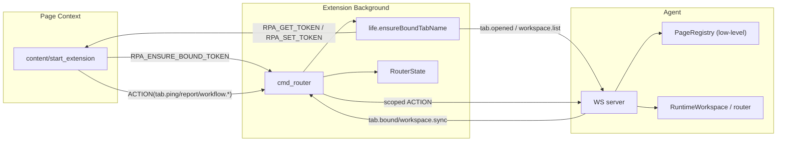
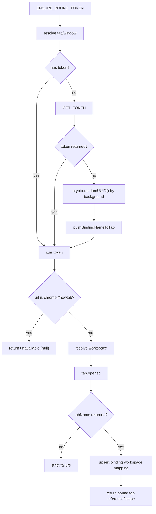
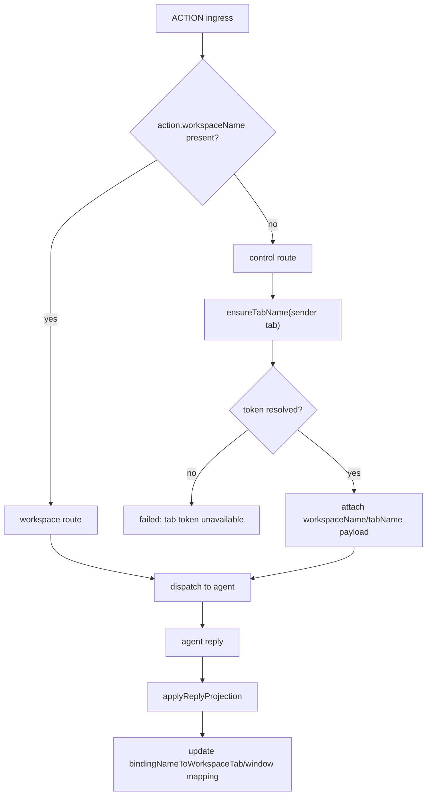

# WorkspaceAndTab

## 1. 强约束（唯一来源）

- `bindingName` 由 extension background 使用 `crypto.randomUUID()` 本地生成，不依赖 agent。
- extension background 通过 `pushBindingNameToTab` 将 binding name 写入 tab。
- content 与 start_extension **禁止**直接发送 `tab.opened`。
- `tab.opened` 的唯一发送入口：**extension background**。
- 页面侧（content/start_extension）只能通过 `RPA_ENSURE_BOUND_TOKEN` 申请已绑定 token。

## 2. 运行时对象

- agent: `PageRegistry` 作为低层 page 绑定基础设施，供 `WorkspaceTabs` 内部使用。
- extension background: `RouterState` 维护 `tabState`、`bindingNameToWorkspaceTab`、`windowToWorkspace`。
- 绑定目标：每个 `tabName` 必须映射到唯一 `(workspaceName, tabName)`。
- `RuntimeWorkspace` 聚合体持有：`tabs`、`record`、`dsl`、`checkpoint`、`entityRules`、`runner`、`mcp`、`router`。

## 3. 通信总线

### 3.1 runtime message（页面 <-> background）

- `RPA_ENSURE_BOUND_TOKEN`
- `RPA_GET_TOKEN`
- `RPA_SET_TOKEN`
- `ACTION`
- `RPA_HELLO`

### 3.2 action（background <-> agent）

- 绑定相关：`tab.opened`
- 生命周期：`tab.report`、`tab.ping`、`tab.activated`、`tab.closed`、`tab.reassign`
- workspace：`workspace.list`、`workspace.create`、`workspace.setActive`

## 4. 绑定流程（硬规则）

1. 页面发 `RPA_ENSURE_BOUND_TOKEN`。
2. background `ensureBoundTabName` 处理：
- 先尝试 `state` / `preferredToken` / `GET_TOKEN`。
- 无 token 时由 background 用 `crypto.randomUUID()` 本地生成 binding name，并通过 `pushBindingNameToTab` 写入页面。
- 解析 workspace（`tokenScope -> window mapping -> active workspace -> workspace.list`）。
- 发 `tab.opened` 完成 agent 绑定；必须拿到 `tabName` 才算成功。
3. 返回 `{ tabName, workspaceName, tabName }` 给页面。
4. 页面拿到绑定结果后，才允许发 `tab.ping/tab.report/workflow.*`。

## 5. chrome://newtab 阶段规则

- `chrome://newtab` 阶段不发送生命周期动作。
- `ensureBoundTabName` 在该阶段直接返回不可用（null），调用方不得继续发送业务 action。

## 6. agent 侧严格语义

- Action 入口分流仅按 `workspaceName` 存在与否；缺失或非法地址返回 `ERR_BAD_ARGS`。
- `workspaceName` 与 `payload.workspaceName` 同时存在 → 非法路由。
- 未知 token 不做降级、不吞错。
- `tab.opened` 由 `bindTabOpenedAction` 专门处理，并执行 claim/bind。

## 7. 关键失败定义

- `resolve_scope_from_token.miss`：agent 未找到 token->scope 映射。
- `tab.opened.defer_claim`：agent 尚未完成 token page 绑定，`tab.opened` 暂未拿到 `tabName`。

## 8. 详细通信图

### 8.1 分层拓扑

### 8.2 ENSURE_BOUND_TOKEN 分支

### 8.3 ACTION 入口

## 9. 代码定位

- extension
- `src/background/life.ts`
- `src/background/cmd_router.ts`
- `src/background/action.ts`
- `src/content/token_bridge.ts`
- `src/entry/content.ts`
- start_extension
- `src/entry/newtab.ts`
- agent
- `src/index.ts`
- `src/runtime/workspace/workspace.ts`
- `src/runtime/workspace/tabs.ts`
- `src/runtime/workspace/router.ts`
- `src/runtime/browser/page_registry.ts`

## 10. 当前运行时边界

- `RuntimeWorkspace` 聚合体直接持有：`tabs`、`record`、`dsl`、`checkpoint`、`entityRules`、`runner`、`mcp`、`router`。
- `RuntimeWorkspace` 不持有：`tabRegistry`、`getPage`、`controls`、`serviceLifecycle`。
- `WorkspaceTabs` 负责 tab 生命周期管理（create、close、activate、report、ping、reassign），内部持有 `Page` 句柄。
- `PageRegistry` 退化为 `WorkspaceTabs` 内部使用的低层 page 绑定基础设施。
- `WorkspaceRouter` 按 action type 前缀转发到对应 domain control（`tab.*` → TabsControl、`mcp.*` → McpControl 等）。
- `workspaceName === workflowName` 是协议不变量。
- 已删除的 action：`tab.init`、`workspace.save`、`workspace.restore`、`workflow.status`。
